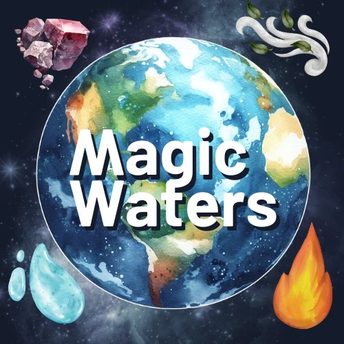

# Magic Waters Codex
This Codex is a living document that contains the context, flag, principles, values, currencies, traditions, and rules of engagement that constitute Magic Waters.

## CONTEXT
You. 
You and me. 
Relating. Intimacy. Love. 

- How can we create a community where Love is what's happening? 
- What is Love? 
- How can we source a context where many others can play and fulfill our hearts' desires? 
- What are your heart's desires? 
- How is it going right now for you and the fulfillment of your heart's desires? 
- How numb are you about where you are now and what you really want?
 

You. 
You and Life. 
Life, God, Source, Love, Principles, Laws. 
What connects you to this world? 
What are you here for? 
What were you created for? 
What is your life's purpose?
 

Magic Waters emerges from the context of the 5 natural elements: Fire, Water, Earth, Air and Eather.

These 5 elements provide hints and guidelines for describing and handling the ongoing present moment.

Wagic Waters is an initiation space into Responsibility, Purpose, Transformation, and Collaboration.

## DISTINCTIONS

Low Drama

## FLAG

## Magic Waters and the 5 Elements

The evolving flag of Magic Waters depicts planet Earth and the 5 Elements:
1) Fire
2) Water
3) Earth
4) Air
5) Eather
Each one of these elements contains their own qualities and wisdom.

The flag represents each element, the transformation between them, and the connection with Gaia, the living planet where we live.

## PRINCIPLES

### Community
We cultivate a community of practice, collectively researching and exploring regenerative ways of living in harmony with nature. Through shared experiences and collaborative learning, we support each other in implementing sustainable practices that nurture both our community and the environment.

### Family
We honour the sacred bonds of family, both biological and chosen, recognizing its fundamental role in weaving the fabric that holds our village together. We nurture these relationships as the cornerstone of a resilient and supportive community.

### Magic
We embrace the profound mystery that underlies existence, recognizing the unseen forces that bind elements into complex systems - from our bodies to galaxies. We approach life with wonder, seeing magic as the gateway to exploring life's deepest questions and inexplicable phenomena.

### Responsibility
We value personal growth and transformation, providing opportunities for members to embark on journeys of self-discovery and initiation into deeper levels of awareness and responsibility.

### Discovery
We encourage curiosity and exploration, creating space for members to uncover new perspectives, skills, and ways of being that align with their highest potential and the collective well-being of our community.

## VALUES
- Sharing, sharing food, resources, stories, music, ...
- Feeling, conscious feelings, distinctions from feelings and emotions.
- Transparency, revealing yourself, putting the guns on the table
- Asking questions, checking assumptions,
- Learning, 
- Taking risks
- Authenticity

## ANTI-VALUES
- Zombie-ism.
- Knowing or Not Knowing.
- Normalcy, mediocrity, getting by, mere surviving.
- Being right or wrong.
- Numbing, not feeling, avoiding, projecting, disowning, distracting.

## RULES OF ENGAGEMENT
Don’t hurt yourself.
Don’t hurt others.
Don’t hurt the space.

## VISION
We envision Magic Waters as a thriving community of practice where individuals are empowered to explore, experiment with and embrace regenerative ways of living with each other and nature.

## Gameplan

- Cultivate deep connections with nature, themselves, and each other

- Freely pursue their personal growth and development in all aspects of life

- Assemble in temporary teams for specific purposes like experimenting, healing, practicing, supporting each other, etc.

- Create spaces for deepening context and research of regenerative cultures, responsibility, human potential and initiations.

- Create innovative solutions for sustainable and harmonious living

- Support one another in realizing their potential

- Create a safe and nurturing environment for members to explore and implement regenerative living practices

- Foster deep connections between members, nature, and themselves

- Provide educational opportunities and resources for personal growth and development

- Facilitate the exchange of knowledge, skills, and experiences among members

- Support members in realizing their full potential through various offerings and activities

- Promote the principles of Natural Law and self-determination within our community

- Inspire and empower members to become catalysts for taking more responsibility in their lives and broader communities 

Through this collective journey, Magic Waters becomes a beacon of change, inspiring a broader shift towards more conscious, regenerative, and fulfilling ways of living in alignment with the natural world.

## CURRENCIES

- Transformational spaces

- Practice spaces

- Listening spaces

- Possibility Coaching

- Cow's milk

- Variety of Medicinal Plants

- Quality Crafting Materials

- Gemstones, silver, gold and precious rocks

- Connection with new potential members and allies

- Appreciation and Empowerment Money (Money given for the purpose of appreciation or empowerment)

## TRADITIONS
Birthday Celebration. 
Tell the story of your birth. 
Receive appreciation. 
Ask your mother to tell the story of your birth.

** TBD **

Winter Solstice Celebration.

Spring Equinox Celebration.

Summer Solstice Celebration.

Fall Equinox Celebration.

Asking for space to be held. Take responsibility for sourcing the spaces you need. "Who would hold space for my fear of being angry?"

## ORIGINS

The name Magic Waters was originated by Jorge Pedret in 2022 based on research conducted by Jorge on a collaborative technology called Loom (or “Telar” in Spanish).

The name Waters comes from the 5 elements: Fire, Water, Earth, Air and Eather.

The Loom has clusters of evolving teams, each member with A different role based on the 5 elements.

Water is the element in the center that goes through the evolution of the other 3 elements Fire, Air and Earth, before it transforms into Eather.

A Magic Water is an element that has gone many times through all the possible transformations (Fire to Air, Air to Earth, Earth to Water, Water to Eather), and has the power to create something from nothing, in other words, to initiate other elements to form a new Loom from scratch.

More details about Loom and Loom Economy here: https://loomeconomy.mystrikingly.com/